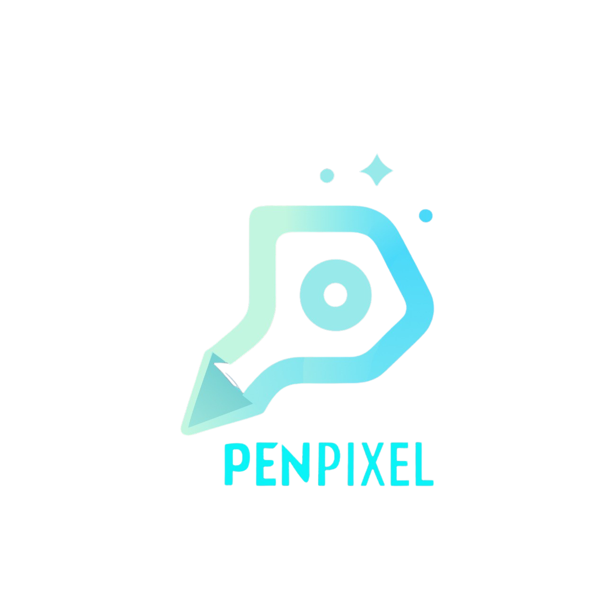

# PenPixel LLP

  
  
  <h1>PenPixel LLP</h1>
  
<em>Redefining the Future with AI, Automation & Intelligent Content</em>

  
  
  
  
  
  > "Transforming ideas into intelligent solutions through the perfect blend of human creativity and artificial intelligence."

  
  
  
  
  
  
  

## 🚀 About PenPixel

PenPixel LLP is a UK-based technology powerhouse specializing in AI-powered solutions, workflow automation, and innovative content creation. Founded by Nikesh Jagdish Malik, we harness the full potential of cutting-edge technologies to help businesses transcend operational limitations and establish commanding digital presences.

Our mission is to democratize access to advanced AI technologies while delivering solutions that are both innovative and practical. We don't just implement technology; we reimagine what's possible.

## 💼 Our Services

- **Advanced AI Integration**: Custom solutions leveraging frontier LLMs and proprietary fine-tuning
- **Enterprise Automation**: End-to-end workflow automation with intelligent decision-making capabilities
- **Next-Gen Web Development**: Ultra-responsive websites with Next.js, React and immersive UX
- **AI-Powered Content Creation**: Generative content with emotion, factual accuracy, and purpose
- **Technical Consulting**: Strategic guidance on AI implementation, scaling, and optimization
- **Computer Vision Solutions**: Image recognition, object detection, and visual data processing
- **NLP & Conversational AI**: Advanced chatbots, sentiment analysis, and text processing systems

## 🌌 Technology Universe

  
  
  
  
  
  
  
  
  
  
  
  
  
  
  
  
  
  
  
  

## 🌟 Featured Projects

### 1. Pixel Writers
**A comprehensive content platform with AI-driven SEO tools and automated workflows.**

**Tech Stack:** Next.js, TailwindCSS, OpenAI GPT-4, PostgreSQL, FastAPI

  

### 2. News in Pixel
**Automated news generation and posting system for social media platforms with sentiment analysis.**

**Tech Stack:** Python, BERT, Claude API, n8n, MongoDB, React Native

  
  

### 3. iWay EMS
**Employee management system with real-time task tracking, AI-powered productivity insights, and administration.**

**Tech Stack:** React, Node.js, Socket.io, MongoDB, Redis, TensorFlow

  

### 4. PixelBeats
**AI-powered music generation platform focusing on devotional content using deep learning models.**

**Tech Stack:** PyTorch, Magenta, Web Audio API, TypeScript, FastAPI

  

## 🌐 Custom AI Solutions

At PenPixel, we specialize in developing custom AI solutions leveraging multiple frontier LLM APIs:

- **OpenAI GPT-4** - Advanced natural language processing with multimodal capabilities
- **Claude 3 by Anthropic** - Nuanced content generation with reasoning abilities
- **Llama 3 by Meta** - Open-source LLM integration with customizable parameters
- **Google Gemini** - Multimodal AI capabilities for comprehensive data understanding
- **Mistral AI** - Advanced open-weight models with state-of-the-art performance
- **Groq** - High-speed inference for production systems requiring real-time responses
- **Custom Fine-tuned Models** - Domain-specific solutions with proprietary training

Our AI integration services help businesses automate workflows, generate content, and enhance customer experiences through cutting-edge technology that adapts to evolving needs.

## 📈 Enterprise Automation

We design comprehensive automation solutions using:

- **n8n** - Powerful workflow automation platform with visual programming
- **Python** - Custom scripts and automation tools for complex processing
- **API Integrations** - Connecting multiple services seamlessly across platforms
- **AI-Powered Decision Making** - Intelligent routing and processing of information
- **Robotic Process Automation (RPA)** - Automating repetitive human-computer interactions
- **Event-Driven Architecture** - Real-time responses to business events
- **Monitoring & Analytics** - Performance tracking and continuous improvement

Our automation solutions have helped businesses reduce operational costs by up to 40% while improving efficiency and accuracy through intelligent process orchestration.

## 🧠 Research & Innovation

At PenPixel, we're constantly pushing the boundaries of what's possible:

- **Multimodal LLM Applications** - Combining text, image, and audio understanding
- **Reinforcement Learning from Human Feedback (RLHF)** - Training models on human preferences
- **Explainable AI** - Making AI decisions transparent and understandable
- **Few-Shot Learning** - Adapting models with minimal examples
- **Ethical AI Development** - Building responsible AI systems with fairness in mind
- **Knowledge Graph Integration** - Enhancing AI with structured knowledge representations

Our research initiatives feed directly into our client solutions, ensuring you always benefit from the latest advancements in AI technology.

## 👥 Our Team of AI Visionaries

  

  
### Nikesh Jagdish Malik
**Founder & CEO**

*Visionary leader driving innovation and strategic direction*

### Dhanashree Tandel
**HR Manager**

*Orchestrating our human intelligence network*

### Vivek Kashav
**Social Media Manager**

*Amplifying our digital presence through data-driven strategies*

### Astik Sheoran
**Full Stack Developer**

*Architecting seamless experiences from back-end to front-end*

### Sankalp Dubedy
**AI-ML Intern**

*Exploring the frontiers of machine learning applications*

### Pranav Sunil
**AI-ML Engineer Intern**

*Building the neural networks of tomorrow*

## 🔮 The Future We're Building

At PenPixel, we're not just adapting to the future—we're actively creating it. Our vision extends beyond current technological limitations to a world where AI seamlessly augments human creativity and productivity.

**Join us in shaping a future where technology empowers rather than replaces human potential.**

## 🔒 Legal Notice

  

    <strong>⚠️ COPYRIGHT NOTICE:</strong> All projects and automation solutions are subject to copyright and IP protection under Indian law. Unauthorized reproduction or use may result in legal action.
  

## 📫 Get in Touch

  
  
  
  
  

---

  
<em>Where Human Creativity Meets Artificial Intelligence</em>

  
© 2023-2024 PenPixel LLP. All Rights Reserved.

## 📚 Learn More

- [Detailed AI & Automation Services](AI-SERVICES.md)
- [Project Portfolio](PROJECTS.md)
- [About Our Founder](PROFILE.md)